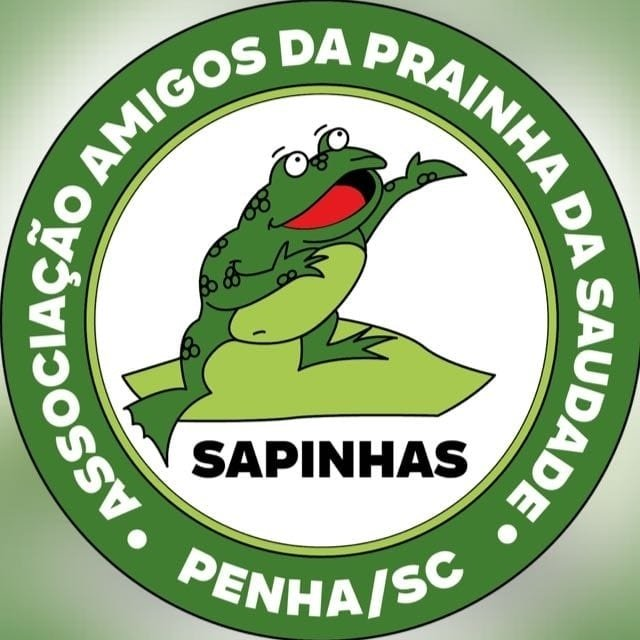

 

Sociedade de Amigos da Prainha da Saudade, SAPINHAS. Penha, Santa Catarina.

## Institucional
 [Repetir de maneira simples o Estatuto]
  - Missão e visão
  - Objetivos; escopo de trabalho; fora de escopo;

Quem é quem

## Relatórios
 

 
Reunião online 2024, Novembro

A reunião de 10 de novembro de 2024 discutiu podas de árvores, projetos de decks e melhorias de acessibilidade, mas muitos planos não avançaram devido à falta de recursos da prefeitura. Foi destacada a necessidade de chuveiros na praia, sinalização e manutenção de espaços públicos. Doações arrecadadas visam a construção de um posto de saúde. Questões de trânsito e fiscalização também foram debatidas, assim como a preocupação com vegetação exótica e vandalismo. A reunião encerrou às 21h30.
 

 
 - [anotações](<reunioes/2024-Nov-10.html>)

## Documentos

2024
  - [Comunicado interno 26.08.2024](<docs/2024/Comunicado 26.08.2024.pdf>)
  - [Carta compromisso candidatos a prefeito](<docs/2024/Carta_aos_Candidatos_a_Prefeito_29_assinado_AMAPGassinado_assinado_assinado.pdf>)

Principais documentos
  - [Estatuto Oficial da SAPINHAS.pdf](<docs/Estatuto Oficial da SAPINHAS.pdf>)
  - [Ficha Associado.xlsx](<docs/Ficha Associado.xlsx>)

## Links
- [Instagram](https://www.instagram.com/praia_da_saudade/)

